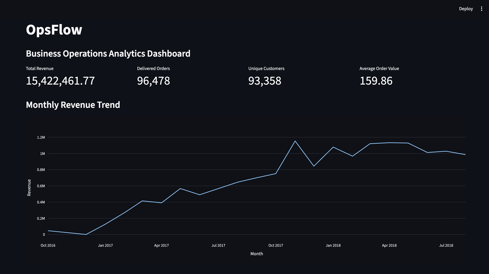
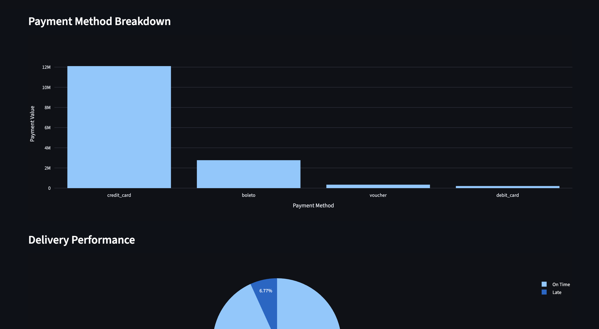
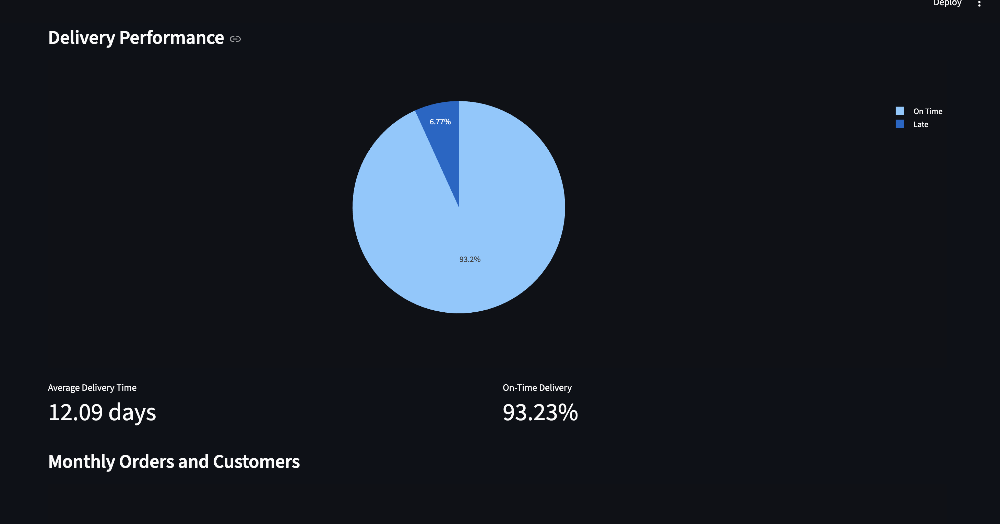
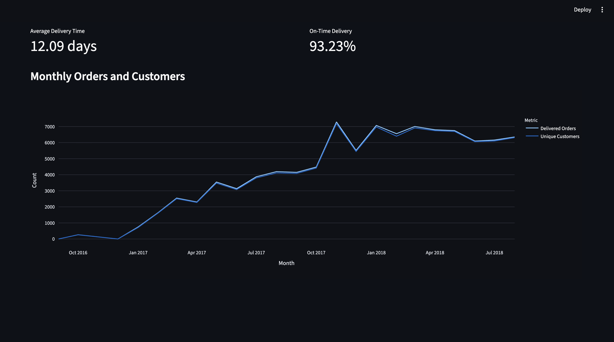

# OpsFlow

OpsFlow is an end-to-end business data pipeline and analytics dashboard built using Python, PostgreSQL, SQL, Streamlit, and Plotly.

The project uses the Brazilian E-Commerce Public Dataset by Olist to demonstrate a complete workflow from raw multi-table business data to cleaned relational data, SQL-based business metrics, and an interactive analytics dashboard.

## Project Goals

The goal of OpsFlow is to demonstrate practical data engineering and analytics skills, including:

- ingesting raw CSV data
- validating required fields and business rules
- cleaning and standardising data
- handling missing values and duplicate records
- designing a relational PostgreSQL schema
- loading cleaned data into PostgreSQL
- writing SQL queries for business analytics
- building a Streamlit dashboard
- testing validation logic using pytest

## Architecture

```text
Raw CSV Data
    ↓
Python Ingestion
    ↓
Validation
    ↓
Cleaning
    ↓
Data Quality Reporting
    ↓
PostgreSQL
    ↓
SQL Analytics
    ↓
Streamlit Dashboard

## Dashboard Screenshots

### Overview



### Payment Methods



### Delivery Performance



### Monthly Orders and Customers

